layout:true

Data Analytics for Cities - Part 1 by <a xmlns:cc="http://creativecommons.org/ns#" href="http://www.datapolitan.com" property="cc:attributionName" rel="cc:attributionURL">Richard Dunks</a> is licensed under a <a rel="license" href="http://creativecommons.org/licenses/by-nc-sa/4.0/">Creative Commons Attribution-NonCommercial-ShareAlike 4.0 International License</a>.

---

class: center,middle
# Data Analytics for Cities (Part 1)
## Intelligent Cities: Technology, Policy and Planning
## Richard Dunks

### Follow along at: https://data-guest-lectures.github.io/data-analytics-for-cities-pt1

---

# Introductions
+ Name
+ An interesting thing you've learned so far in this class
+ One thing you associate with the term "open data" 

---

# Goals
--

+ Review key features of open data
--

+ Discuss sources of government open data
--

+ Discuss challenges working with government open data
--

+ Introduce methods of analyzing government open data

---

class:center,middle
# Why do we collect data? 
<!-- # What is the value of data in intelligent cities? -->

---

# Why do we collect data?
--

+ Data describes phenomena of interest
--

+ Can describe the phenomena directly or indirectly

--

---

# Why do we collect data?
+ Data describes phenomena of interest
+ Can describe the phenomena directly or indirectly
+ Can't manage what you can't measure

<!-- 

class:center,middle
# Government open data (should) tell us how laws are implemented

class:center,middle

Source: [Meet the Fire Hydrant that Unfairly Nets NYC $25,000 a Year](http://iquantny.tumblr.com/post/83696310037/meet-the-fire-hydrant-that-unfairly-nets-nyc)
 --> 

---

class: center,middle
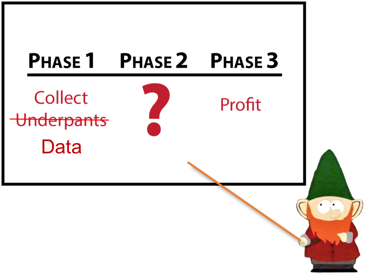

---

class:center, middle
# So what is Phase 2 for cities?

---

class: center,middle

---

class: center,middle
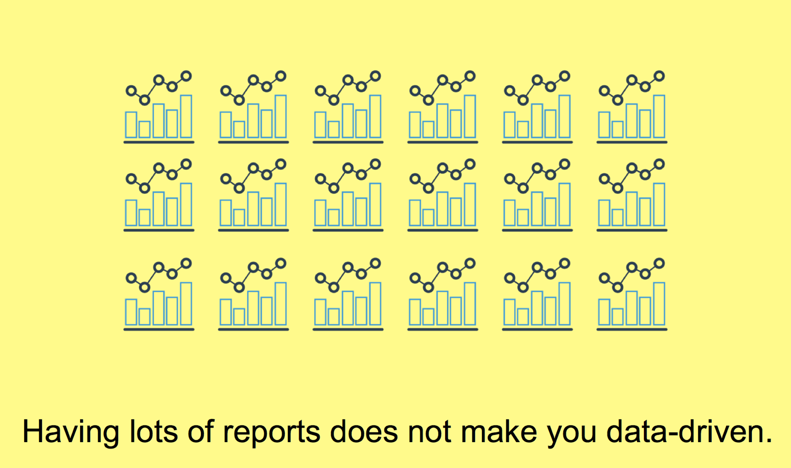
Source: [Carl Anderson, Creating a Data-Driven Organization](http://www.slideshare.net/CarlAnderson4)

---

class: center,middle
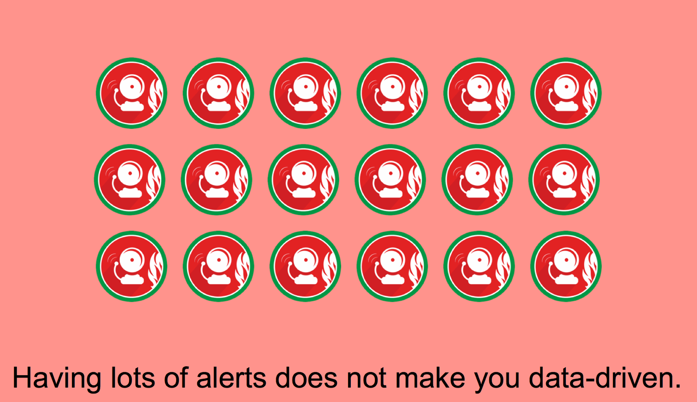
Source: [Carl Anderson, Creating a Data-Driven Organization](http://www.slideshare.net/CarlAnderson4)
---

class: center,middle
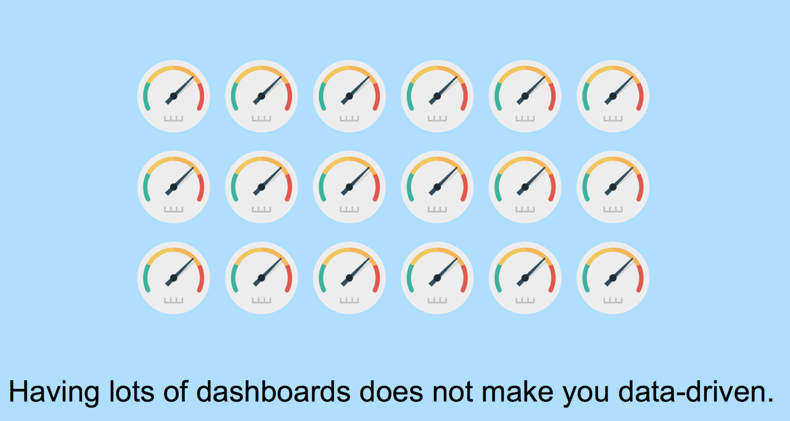
Source: [Carl Anderson, Creating a Data-Driven Organization](http://www.slideshare.net/CarlAnderson4)

### http://www.corridorscope.com

---

class:center,middle
# It's about bringing these all together

---

# Analytics Value Chain
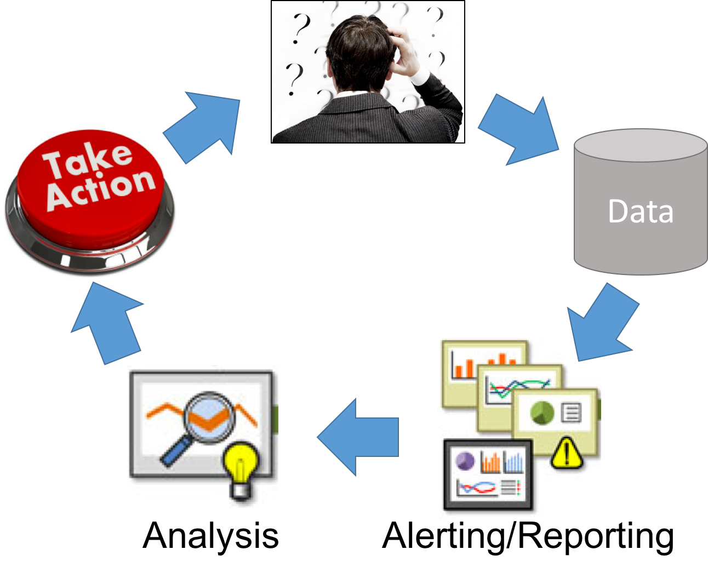
---

class:center,middle

---

class: center,middle
> Not everything that can be counted counts, and not everything that counts can be counted.

## -Albert Einstein

---

class:center,middle
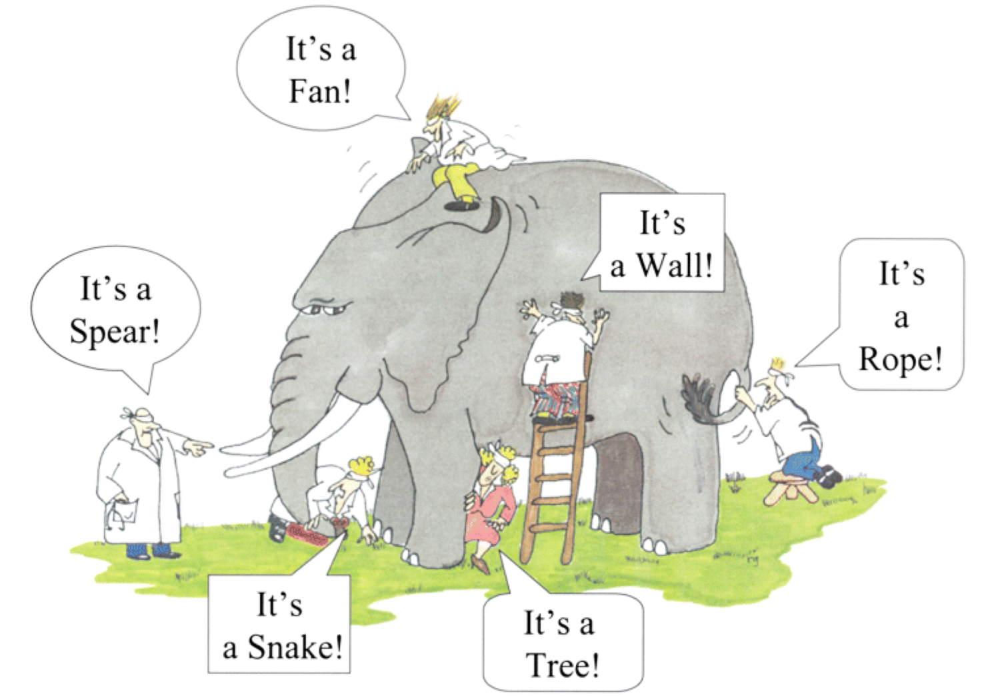

---

class:center,middle

Source: [Carl Anderson, Creating a Data-Driven Organization](http://www.slideshare.net/CarlAnderson4)

---

class:center,middle
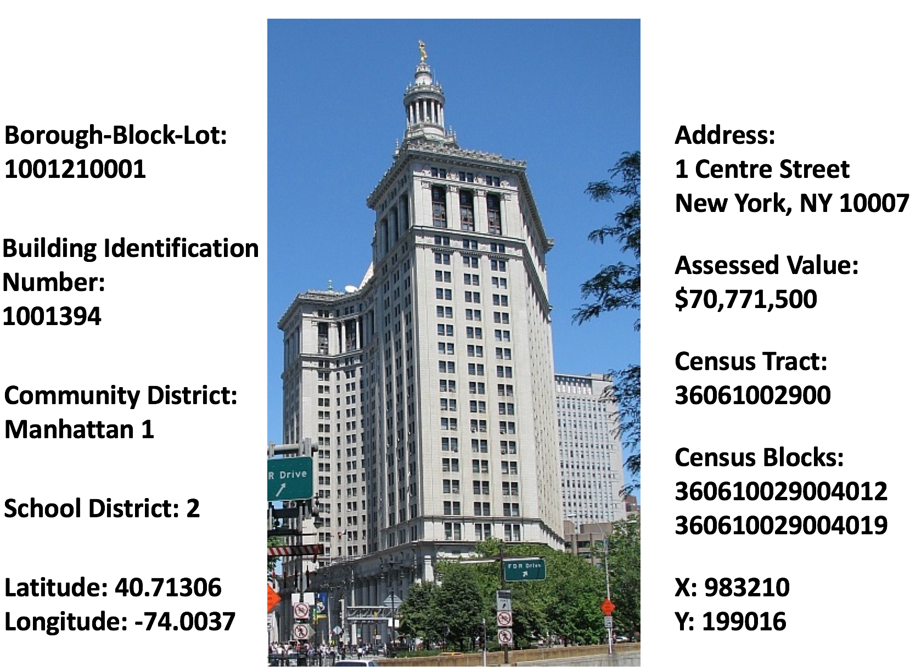

---

class:center,middle
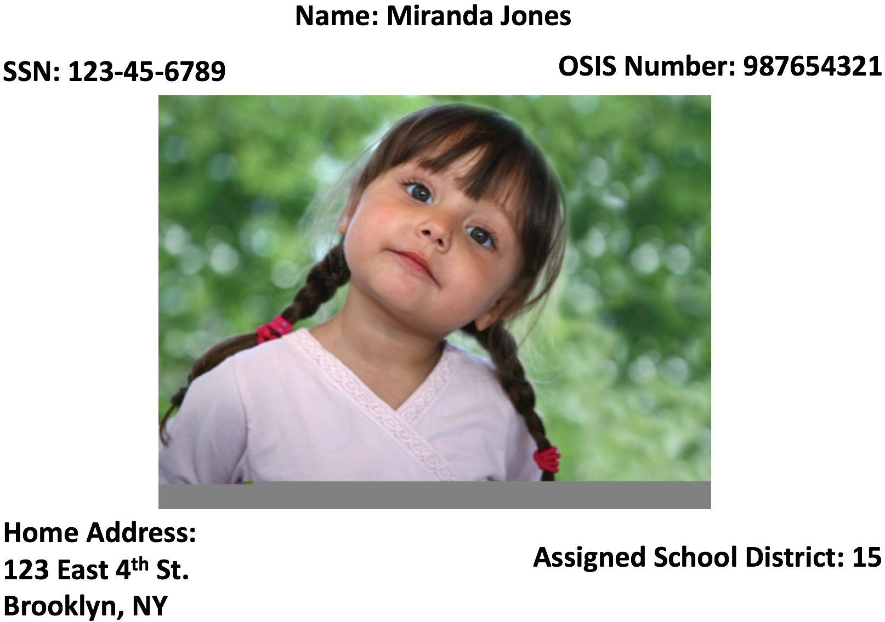

---

class: center,middle

<!-- 
> Facts do not "speak for themselves." They speak for or against competing theories. Facts divorced from theory or visions are mere isolated curiosities.

##-Thomas Sowell *A Conflict of Visions* -->

---

# But don't blindly follow data
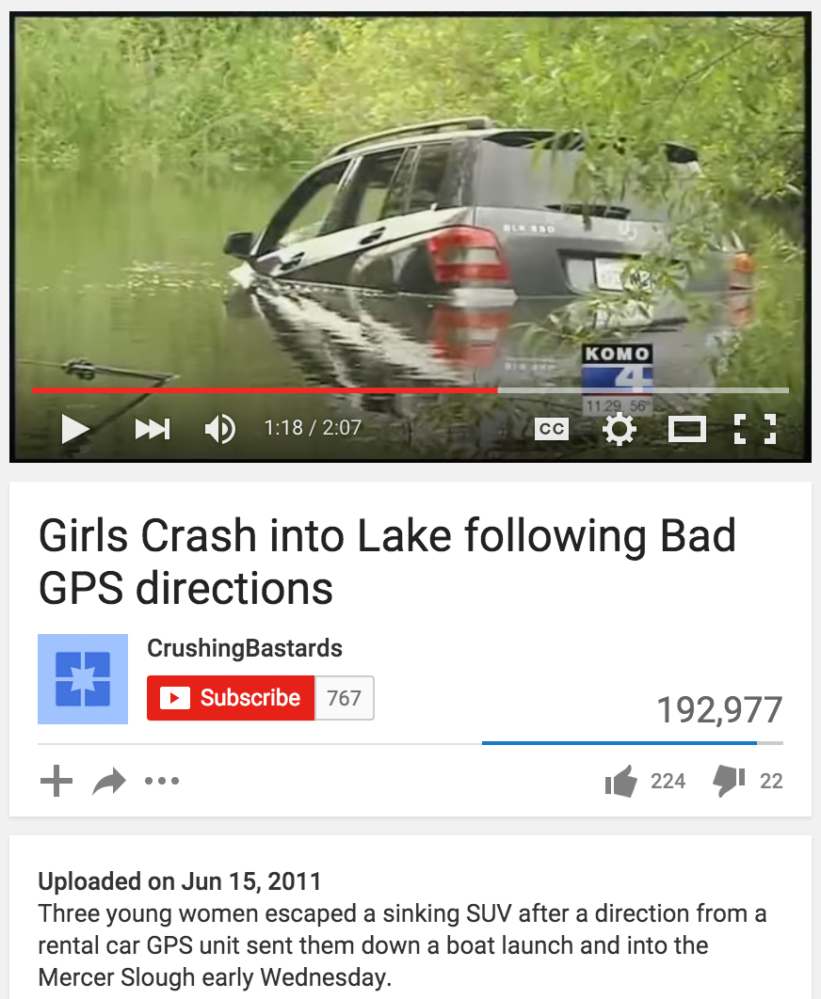
##### https://www.youtube.com/watch?v=a2QIH2uz3p8

---

# You could regret it

http://appleinsider.com/articles/13/05/16/intel-chips-could-have-powered-first-iphone-ceo-otelini-says

---

class: center, middle
# What is open data?

---

class: middle, center
> Open data is data that can be freely used, shared and built-on by anyone, anywhere, for any purpose

## [Open Knowledge Foundation](http://blog.okfn.org/2013/10/03/defining-open-data/)

---

# Key Features of Open Data

---

# Key Features of Open Data
+ Availability and access

---

# Key Features of Open Data
+ Availability and access
+ Reuse and redistribution

---

# Key Features of Open Data
+ Availability and access
+ Reuse and redistribution
+ Universal participation

---

# Benefits of Open Data

---

# Benefits of Open Data
+ Transparency
---

# Benefits of Open Data
+ Transparency

---

# Benefits of Open Data
+ Transparency
+ Releasing social and commercial value
---

# Benefits of Open Data
+ Transparency
+ Releasing social and commercial value

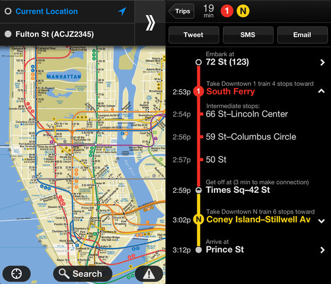
---

# Benefits of Open Data
+ Transparency
+ Releasing social and commercial value

---

# Benefits of Open Data
+ Transparency
+ Releasing social and commercial value

---

# Benefits of Open Data
+ Transparency
+ Releasing social and commercial value

---

# Benefits of Open Data
+ Transparency
+ Releasing social and commercial value
+ Participation and engagement
---

# Benefits of Open Data
+ Transparency
+ Releasing social and commercial value
+ Participation and engagement

---
class:center,middle
# Concerns with Open Data

---

# Reliability

---

# Reliability
+ Veracity of source

---

# Reliability
+ Veracity of source
+ Currency of data

---

# Privacy

---

# Privacy
+ Personally identifiable information (PII)
---

# Privacy
+ Personally identifiable information (PII)

---

# Privacy
+ Personally identifiable information (PII)

---

# Privacy
+ Personally identifiable information (PII)
+ Mosaic Effect

---

# Confidentiality

---

# Confidentiality
+ Proprietary information

---

# Confidentiality
+ Proprietary information
+ Trade secrets

---

# Confidentiality
+ Proprietary information
+ Trade secrets
+ Government procurement information

---

# Security

---

# Security
+ Identify sensitive infrastructure

---

# Security
+ Identify sensitive infrastructure
+ Describe methods and procedures

---

class:center,middle
# Open Data Sources
## &nbsp;

---

class:center,middle
# Open Data Sources
## In order of usability

---

# Open Data Portals

---

# Application Program Interface (API)

[Credit: Zapier "An Introduction to APIs"](https://zapier.com/learn/apis/) 
---

# Application Program Interface (API)
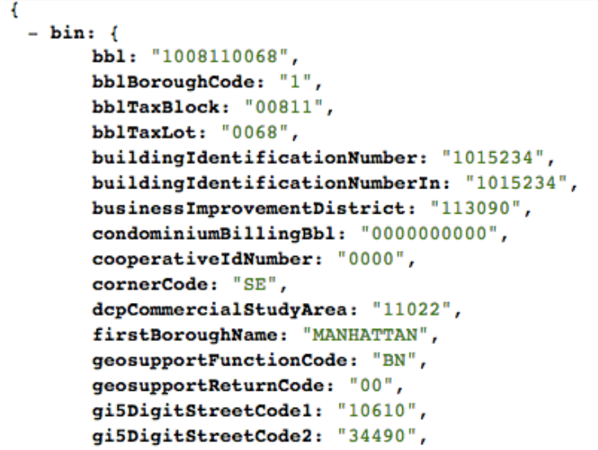

---

# Web Scraping

[Introduction to web scraping by Thomas Levine](http://thomaslevine.com/dada/web-sites-to-data-tables/)
---

# Web Scraping

[Web Scraping with OpenRefine video from Eric Brelsford](http://www.youtube.com/watch?v=KQlCTo0Q71Q)

---

class:middle,center

# If it's online, you can get the data
## &nbsp;

---

class:middle,center

# If it's online, you can get the data
## Trust me

---

class:middle,center
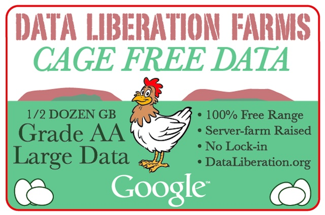

Source: http://arstechnica.com/tech-policy/2010/03/why-google-makes-it-easy-to-leave-google/

---

# Exploratory Data Analysis
--

+ Goal -> Discover patterns in the data
--

+ Understand the context
--

+ Summarize fields
--

+ Use graphical representations of the data
--

+ Explore outliers

--

### Tukey, J.W. (1977). Exploratory data analysis. Reading, MA: Addison-Wesley.

---

# So Let's Work with Some Open Data

---

# So Let's Work with Some Open Data

---
class:center,middle

# https://data.cityofnewyork.us/

---

# What are some of the questions we could ask of this data?
--

+ Time of calls
--

+ Location of calls
--

+ Time calls remain open

---
# Exercise
## Looking at the type, frequency, and location of noise compliants:
+ Find one thing that you expected in the data
+ Find one thing you found surprising in the data

---

## History of Open Data
+ Tauberer, Joshua, Open Government Data: The Book ["Ancient Origins of Open Access to Laws"](https://opengovdata.io/2014/ancient-origins-open-access-to-law/)
+ Chignard, Simon, "[A brief history of open data](http://www.paristechreview.com/2013/03/29/brief-history-open-data/)" ParisTech Review

---

# Thank You
+ [richard@datapolitan.com](mailto:richard@datapolitan.com)
+ http://blog.datapolitan.com
+ [@rdunks1](https://twitter.com/rdunks1)/[@datapolitan](https://twitter.com/Datapolitan)

